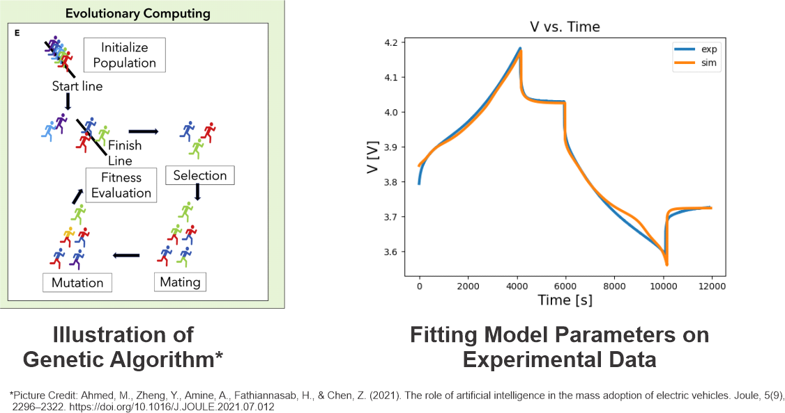
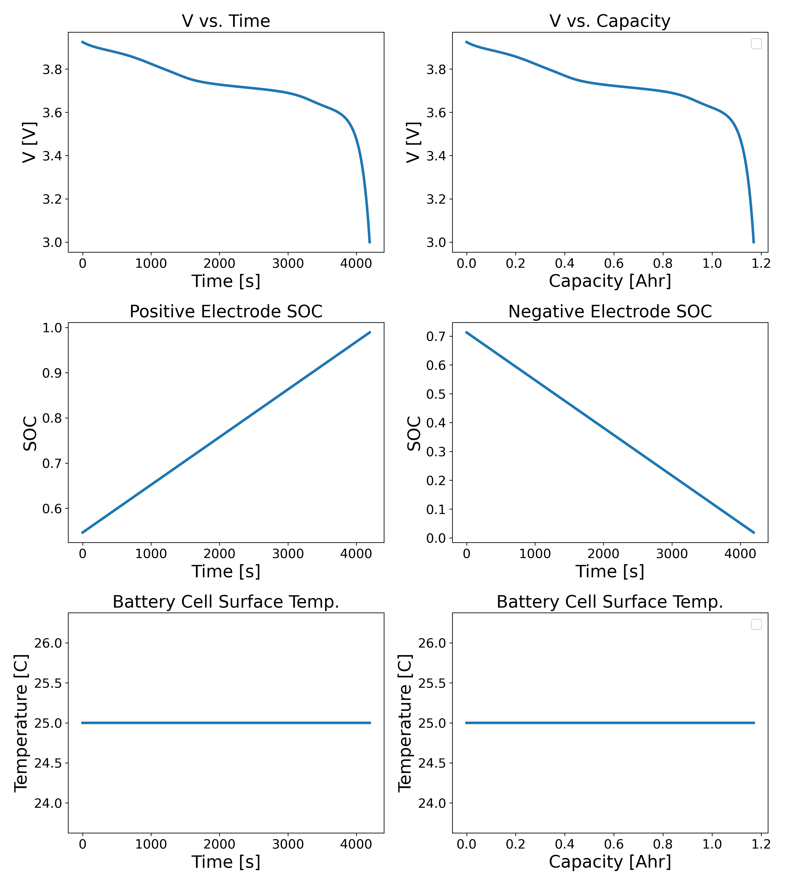

# Lithium-Ion Cell Terminal Voltage Models coupled with Thermal and Degradation Models
#### Copyright© 2023 by Moin Ahmed. All rights reserved.

## Description

<p>
This repository contains the code for running equivalent circuit model (ECM) and single particle model (SPM) with thermal and degradation models on 
Lithium-ion Batteries (LIB). Moreover, the repository contains the tools for visualization and 
parameter estimations (using genetic algorithm).
</p>
<p>
All the code is written in Python programming language, and it is written in a modular fashion. The code is
still an ongoing work and the documentation is not yet complete.
</p>
The [documentation](https://libsim.readthedocs.io/en/latest/) is available and currently hosted on readthedocs.io.

## Features

- <b>Single Particle Model (SPM) and Equivalent circuit model with thermal (lumped thermal) and degradation (reduced-order SEI) models

- Parameter estimation using genetic algorithm

- Visualization tools</b>
- Sigma Point Kalman Filter (for analyzing application' battery management system (BMS)) </b>

## Dependencies
- Python 3.10 and above
- numpy
- pandas
- matplotlib
- scipy
- tqdm

## Installation

Either of the two recommended installation procedures can be used and the steps for these 
installation procedures are listed below.

### Git Clone

1. Install external python package dependencies required for this repository. The required dependencies are:
   - numpy
   - pandas
   - matplotlib
   - scipy
   - tqdm
2. Clone the repository, for example using git clone git@github.com:m0in92/EV_sim.git using Git Bash.

### Python setup
1. Download or clone this repository 
2. Ensure you are on the repository directory (where the setup.py resides) and run python setup.py sdist on the command line.
3. Step 2 will create a dist directory in the repository. Extract the contents tar.gz file in this directory. Move to 
the directory where the extracted files reside and run pip install EV_sim on the command line. This will install EV_sim
on your system (along with the external dependencies) and EV_sim can be imported as any other Python package.

## Usage

Example usage are included in the SPPy/examples folder.

## Directory Structure:

```parameter_sets``` - the datasets containing the parameters for the simulations.

```Assests``` - the images used in the documentations.

```SPPy``` - the source code. Some of the subdirectories include:
- ```examples``` - the example usage under various simulation conditions.
- ```battery_components``` - classes for reading and storing battery cell component (e.g., electrode, electrolyte) parameters 
- ```models``` - classes with methods pertaining to battery, thermal, and degradation models
- ```solvers``` - numerical and simulation solvers
- ```visualization``` - visualization related classes

```tests``` - test files for this repository


## Solution Scheme
### Single Particle Model:
#### _Diffusion Equation Formulation:_
- Crank-Nicolson Method
- Eigen Function Expansion [1]
- Two Term Polynomial [2]
#### _Numerical Schemes:_
- ODE solvers (rk4)
### Equivalent Circuit Model
#### _Solution Schemes:_
- Discrete Time Solver
- Discrete Time Solver with Sigma Point Kalman Filter (under construction)
### Thermal Models:
- Lumped Thermal Model
#### _Numerical Schemes:_
- ODE solvers (rk4)
### Degradation Models:
- ROM - SEI growth [3]
#### _Numerical Schemes:_
- ODE solvers (Euler)

### Sample Usage
The simulation consists of creating a (1) battery cell, (2) cycler, and (3) solver object. For the battery cell object, the parameters can be read from the parameter sets.

The following gives an example of running a single particle model under isothermal conditions using the 
parameter_set named "test". <br>
<code>
import SPPy

#### Define operating parameters
I = 1.656 </br>
T = 298.15 </br>
V_min = 3 </br>
SOC_min = 0.1 </br>
SOC_LIB = 0.9 </br>

#### Define modelling parameters </br>
SOC_init_p, SOC_init_n = 0.4956, 0.7568  # conditions in the literature source. Guo et al 

#### Setup battery components </br>
cell = SPPy.BatteryCell.read_from_parameter_set(parameter_set_name='test', SOC_init_p=SOC_init_p, SOC_init_n=SOC_init_n, temp_init=T)

#### set-up cycler and solver </br>
dc = SPPy.Discharge(discharge_current=I, V_min=V_min, SOC_LIB_min=SOC_min, SOC_LIB=SOC_LIB) </br>
solver = SPPy.SPPySolver(b_cell=cell, N=5, isothermal=True, degradation=False, electrode_SOC_solver='poly')
</code></br>

The simulation will start once the <code>solve</code> method of the SPPySolver instance is called. This method requires the cycler instance.

<code>
# simulate </br>
sol = solver.solve(cycler_instance=dc)
</code>

The <code>sol</code> object stores various simulation results, including time, cell terminal voltage, electrode's lithium surface concentrations, etc.
Furthermore, it has plotting methods, for eg.,

<code>
# Plot </br>
sol.comprehensive_plot()
</code>

Which outputs a matplotlib plot



### References:
1. Guo, M., Sikha, G., & White, R. E. (2011). Single-Particle Model for a Lithium-Ion Cell: Thermal Behavior. Journal of The Electrochemical Society, 158(2), A122. https://doi.org/10.1149/1.3521314/XML
2. Torchio, M., Magni, L., Gopaluni, R. B., Braatz, R. D., & Raimondo, D. M. (2016).
    LIONSIMBA: A Matlab Framework Based on a Finite Volume Model Suitable for Li-Ion Battery Design, Simulation,
    and Control.
    Journal of The Electrochemical Society, 163(7), A1192–A1205.
    https://doi.org/10.1149/2.0291607JES/XML
3. Randall, A. v., Perkins, R. D., Zhang, X., & Plett, G. L. (2012). Controls oriented reduced order modeling of solid-electrolyte interphase layer growth. Journal of Power Sources, 209, 282–288. https://doi.org/10.1016/J.JPOWSOUR.2012.02.114
