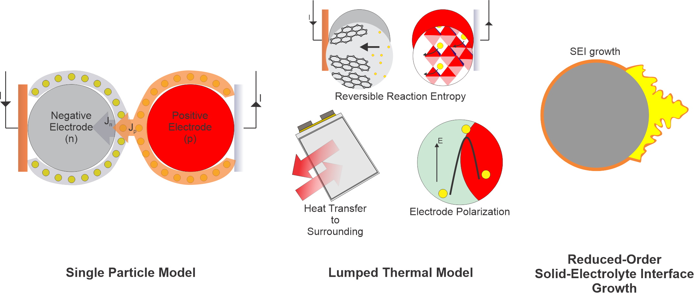

# Single Particle Model with Thermal and Degradation Models
#### Copyright© 2023 by Moin Ahmed. All rights reserved.

## Description

This repository contains the code for running single particle model with thermal and degradation models on 
Lithium-ion Batteries (LIB). Moreover, the repository contains the tools for visualization and 
parameter estimations (using genetic algorithm).

All the code is written in Python programming language, and it is written in a modular fashion. The code is
still an ongoing work and the documentation is not yet complete.

## Features

- <b>Single Particle Model with thermal (lumped thermal) and degradation (reduced-order SEI) models

- Parameter estimation using genetic algorithm

- Visualization tools</b>

## Solution Scheme
### Single Particle Model:
#### _Diffusion Equation Formulation:_
- Eigen Function Expansion [1]
- Two Term Polynomial (not yet implemented)
#### _Numerical Schemes:_
- ODE solvers (rk4)
### Thermal Models:
- Lumped Thermal Model
#### _Numerical Schemes:_
- ODE solvers (rk4)
### Degradation Models: (under construction)
- ROM - SEI growth [2]
#### _Numerical Schemes:_
- ODE solvers (Euler)
### References:
1. Guo, M., Sikha, G., & White, R. E. (2011). Single-Particle Model for a Lithium-Ion Cell: Thermal Behavior. Journal of The Electrochemical Society, 158(2), A122. https://doi.org/10.1149/1.3521314/XML
2. Randall, A. v., Perkins, R. D., Zhang, X., & Plett, G. L. (2012). Controls oriented reduced order modeling of solid-electrolyte interphase layer growth. Journal of Power Sources, 209, 282–288. https://doi.org/10.1016/J.JPOWSOUR.2012.02.114
